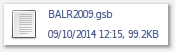
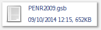
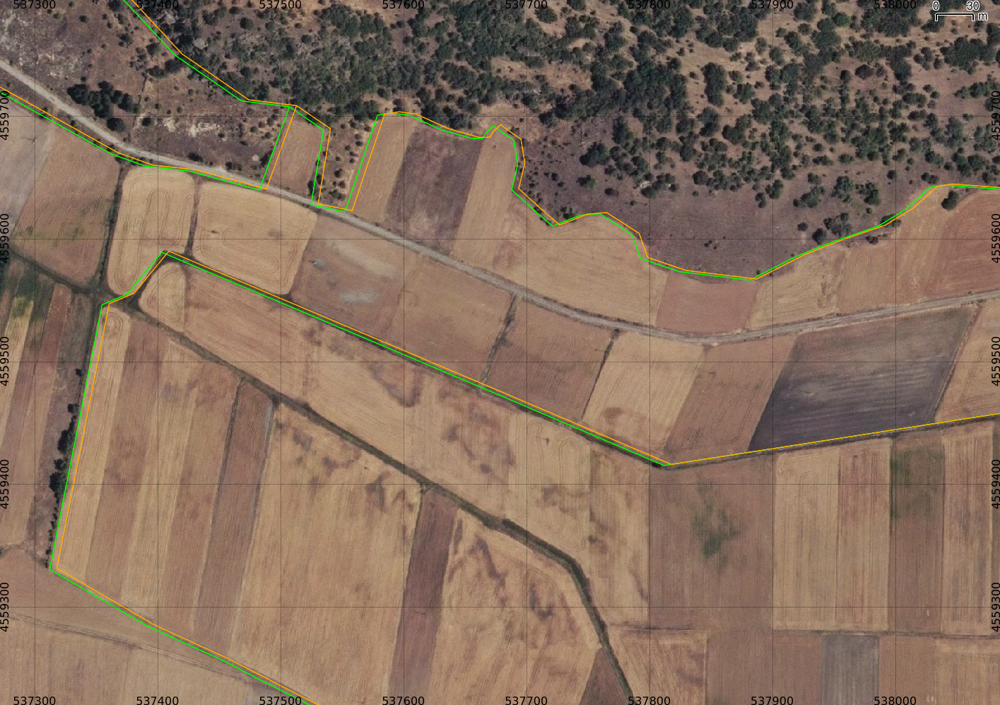

Reproyectar datos del datum ED50 al ETRS89
==========================================

*CC-BY-SA 2016 - M. Sevilla-Callejo*

Cuando se intenta reproyectar un archivo que viene usando el datum ED50
usado antiguamente por el IGN uno encuentra que la reproyección no es
correcta puesto que la los parámetros para la conversión tiene unas
características especiales. Para esto ha de usarse una rejilla de
conversión que suministra el IGN en formato NTV2.

Con las instrucciones de esta nota, tras descargar la rejilla de cambio
de datum, se transforma de ED50 uso 30N (EPSG:23030) a ETRS89 uso 30N
(EPSG:25830).

## Rejilla para cambio de Datum entre ED50 y ETRS89 (en formato NTV2)

Fuente: [http://www.ign.es/ign/layoutIn/herramientas.do](http://www.ign.es/ign/layoutIn/herramientas.do)

La rejilla de transformación de datum constituye la herramienta oficial
para la transformación de datum entre ED50 y ETRS89 en España. Fue
avalada por el Grupo de Trabajo para la transición a ETRS89 compuesto
por todas las Comunidades Autónomas y los Ministerios de Fomento (IGN) y
Defensa. Consta de dos rejillas, una para la península (PENR2009.gsb,
anteriormente llamada R2009v9.gsb siendo idéntica a ésta) y otra para
Baleares denominada BALR2009.gsb. Ambas rejillas están en formato NTV2 y
contienen los incrementos en longitud y latitud entre estos dos datums.
Esta transformación no destruye topología alguna, es eficiente y
contínua con una grado de acuerdo de solo algunos centímetros sobre todo
el territorio.

archivo para la
Península: [http://www.ign.es/ign/resources/herramientas/PENR2009.zip](http://www.ign.es/ign/resources/herramientas/PENR2009.zip)

archivo para
Baleares: [http://www.ign.es/ign/resources/herramientas/BALR2009.zip](http://www.ign.es/ign/resources/herramientas/BALR2009.zip)

## Registrar sistema de coordenadas especial en QGIS

**name**: `ED50 / UTM 30 ES - EPSG23030 + nadgrid`

**parameters**: `+proj=tmerc +lat\_0=0 +lon\_0=6 +x\_0=2500000 +y\_0=0 +k=1.000000 +ellps=bessel +units=m +nadgrids=D:\\path\\to\\your\\archive.gsb +wktext`

example: `+proj=utm +zone=30 +ellps=intl +nadgrids=\~/PENR2009.gsb +units=m +no\_defs +wktext`

## Reproyectar archivos vectoriales - Comando `ogr2ogr`

Fuente: [http://www.gisandchips.org/...](http://www.gisandchips.org/2011/11/28/proyeccion-segura-desde-utm-ed50-con-interfaz-grafico/)

`ogr2ogr -s\_srs '+init=epsg:23030 +nadgrids=./PENR2009.gsb +wktext' -t\_srs EPSG:25830 archivo\_origen archivo\_destino`

## Reproyectar archivos ráster - Comando `gadlwarp`

Fuente: [http://gis.stackexchange.com/...](http://gis.stackexchange.com/questions/38984/how-to-reproject-a-raster-file-in-qgis-with-datum-transformation)

**En edición**

`gdalwarp -s\_srs EPSG:25832 -t\_srs "+proj=tmerc +lat\_0=0 +lon\_0=6 +x\_0=2500000 +y\_0=0 +k=1.000000 +ellps=bessel +units=m +nadgrids=./BETA2007.gsb +wktext" input.tif output.tif`

`gdalwarp -s\_srs EPSG:25832 -t\_srs "+proj=tmerc +lat\_0=0 +lon\_0=6 +x\_0=2500000 +y\_0=0 +k=1.000000 +ellps=bessel +units=m +nadgrids=./BETA2007.gsb +wktext" input.tif output.tif`

## Ejemplo gráfico entre ED50 genérico y el específico con grilla del IGN

De fondo la ortofotografía PNOA del área de Conquezuela (Soria)

En Naranja el genérico y en verde el corregido sobre la WMS de la ortofoto PNOA y todo reproyectado a UTM ETRS89 (el sistema de la ortofoto).

